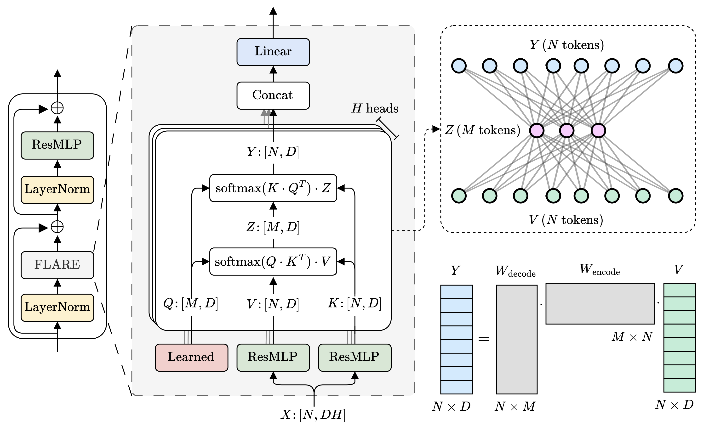
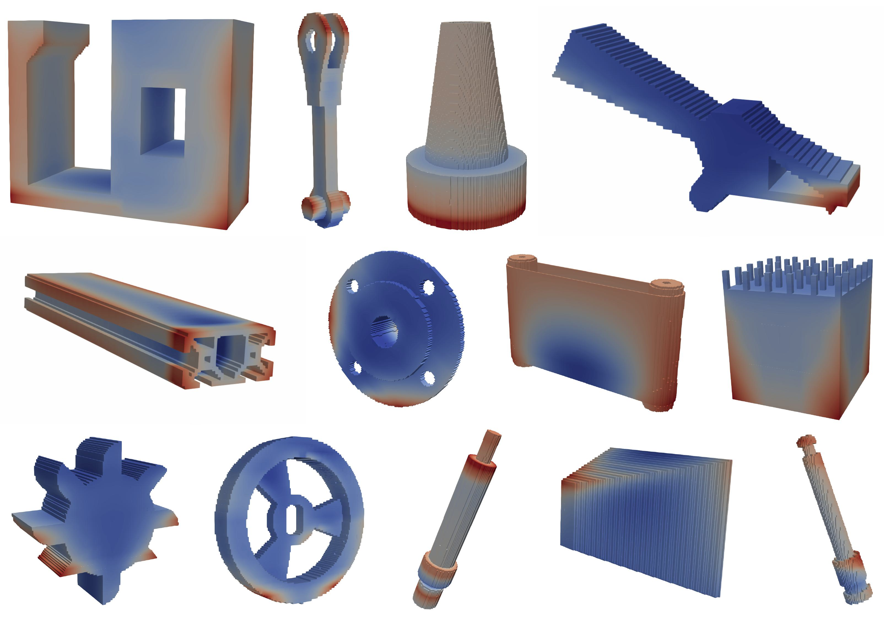

# 🎇 FLARE: Fast Low-rank Attention Routing Engine

<p align="center">
<a href="https://arxiv.org/abs/XXXX.XXXXX" alt="arXiv">
    </a>
</p>

## Abstract
The quadratic complexity of self-attention limits its applicability and scalability on large unstructured meshes.
We introduce \emph{Fast Low-rank Attention Routing Engine (FLARE)}, a linear complexity self-attention mechanism that routes attention through fixed-length latent sequences.
Each attention head performs global communication among $N$ tokens by projecting the input sequence onto a fixed length latent sequence of $M \ll N$ tokens using learnable query tokens.
By routing attention through a bottleneck sequence, FLARE learns a low-rank form of attention that can be applied at $\mathcal{O}(NM)$ cost.
FLARE not only scales to unprecedented problem sizes, but also delivers superior accuracy compared to state-of-the-art neural PDE surrogates across diverse benchmarks.
We also release a new additive manufacturing dataset to spur further research.
Our code is available at
[https://github.com/vpuri3/FLARE.py](https://github.com/vpuri3/FLARE.py).

## Highlights

- **Linear complexity token mixing.** FLARE is an efficient self-attention mechanism designed to learn on long sequences such as point clouds.
By replacing full self-attention with low-rank projections and reconstructions, FLARE achieves linear complexity in the number of points.
- **Superior accuracy.** Across multiple PDE benchmarks, FLARE achieves superior predictive accuracy compared to leading neural surrogate models, despite operating with fewer parameters, and at much lower computational complexity.
- **Scalability.** FLARE is built entirely from standard fused attention primitives, ensuring high GPU utilization and ease of integration into existing transformer architectures.
As such, FLARE enables end-to-end training on unstructured meshes with one million points (see Figure below) without distributed computing (Luo et al., 2025) or memory offloading – the largest scale demonstrated for transformer-based PDE surrogates.

## FLARE

FLARE is a simple yet powerful mechanism designed to break the scalability barrier in PDE surrogate learning.
FLARE is built on the argument that projecting input sequences onto shorter latent sequences, and then unprojecting to the original sequence length, is equivalent to constructing a low-rank form of attention with rank at most equal to the number of latent tokens (see figure below).

Furthermore, we argue that multiple simultaneous low-rank projections could collectively capture a full attention pattern.
Unlike Transolver which shares projection weights across heads, or LNO which applies only a single projection, our design allocates a distinct slice of the latent tokens to each head resulting in distinct projection matrices for each head.
This allows each head to learn independent attention relationships, opening up a key direction of scaling and exploration, wherein each head may specialize in distinct routing patterns.

<p align="center">
  
</p>

FLARE exhibits excellent scaling and can tackle problems with millions of tokens on a single GPU.
We present time and memory requirements of different attention schemes.
On an input sequence of one million tokens, FLARE (red) is over $200\times$ faster than vanilla attention, while consuming marginally more memory.
All models are implemented with flash attention (Dao et al., 2022), and the memory upper bound on a single H100 80GB GPU is depicted with a dashed line.
Note that the curves for FLARE are somewhat overlapping.

<p align="center">
  
</p>

The implementation of FLARE is straightforward and employs highly optimized fused self-attention kernels.

```python
import torch.nn.functional as F
def flare_multihead_mixer(q, k, v):
    """
    Arguments:
    q: Query tensor [H, M, D]
    k: Key tensor [B, H, N, D]
    v: Value tensor [B, H, N, D]
    Returns:
    y: Output tensor [B, H, N, D]
    """

    z = F.scaled_dot_product_attention(q, k, v, scale=1.0)
    y = F.scaled_dot_product_attention(k, q, z, scale=1.0)

    return y
```

## Benchmark dataset of additive manufacturing (AM) simulations.

We simulate the LPBF process on selected geometries from the Autodesk segementation dataset (Lambourne et al., 2021) to generate a benchmark dataset for AM calculations.
Several geometries are presented in this gallery.
The color indicates Z (vertical) displacement field.

<p align="center">
  
</p>

## Bibtex
```
@article{puri2025FLARE,
  title={{FLARE}: {F}ast {L}ow-{r}ank {A}ttention {R}outing {E}ngine},
  author={Puri, Vedant and Joglekar, Aditya and Zhang, Yongjie Jessica and Kara, Levent Burak},
  journal={arXiv preprint arXiv: XXXX.XXXXX},
  year={2025}
}
```
