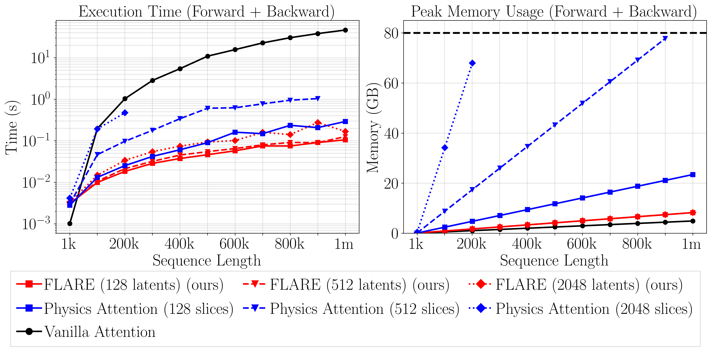

# 🎇 FLARE: Fast Low-rank Attention Routing Engine

<p align="center">
<a href="https://arxiv.org/abs/XXXX.XXXXX" alt="arXiv">
    </a>
</p>

## Abstract
The quadratic complexity of self-attention limits its applicability and scalability on large unstructured meshes.
We introduce \emph{Fast Low-rank Attention Routing Engine (FLARE)}, a linear complexity self-attention mechanism that routes attention through fixed-length latent sequences.
Each attention head performs global communication among $N$ tokens by projecting the input sequence onto a fixed length latent sequence of $M \ll N$ tokens using learnable query tokens.
By routing attention through a bottleneck sequence, FLARE learns a low-rank form of attention that can be applied at $\mathcal{O}(NM)$ cost.
FLARE not only scales to unprecedented problem sizes, but also delivers superior accuracy compared to state-of-the-art neural PDE surrogates across diverse benchmarks.
We also release a new additive manufacturing dataset to spur further research.
Our code is available at
[https://github.com/vpuri3/FLARE.py](https://github.com/vpuri3/FLARE.py).

## FLARE

FLARE learns a low rank attention mechanism.

<p align="center">
  
</p>

FLARE exhibits excellent scaling and can tackle problems with millions of tokens on a single GPU.

<p align="center">
  
</p>

The implementation of FLARE is straightforward and employs highly optimized fused self-attention kernels.

```python
import torch.nn.functional as F
def flare_multihead_mixer(q, k, v):
    """
    Arguments:
    q: Query tensor [H, M, D]
    k: Key tensor [B, H, N, D]
    v: Value tensor [B, H, N, D]
    Returns:
    y: Output tensor [B, H, N, D]
    """

    z = F.scaled_dot_product_attention(q, k, v, scale=1.0)
    y = F.scaled_dot_product_attention(k, q, z, scale=1.0)

    return y
```

## Experiments

## Bibtex
```
@article{puri2025FLARE,
  title={{FLARE}: {F}ast {L}ow-{r}ank {A}ttention {R}outing {E}ngine},
  author={Puri, Vedant and Joglekar, Aditya and Zhang, Yongjie Jessica and Kara, Levent Burak},
  journal={arXiv preprint arXiv: XXXX.XXXXX},
  year={2025}
}
```
